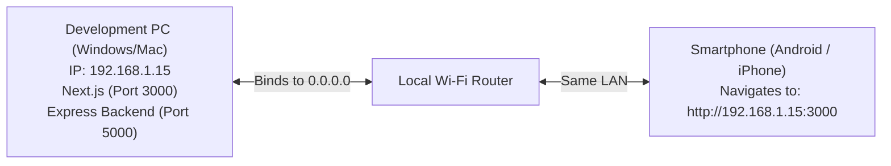
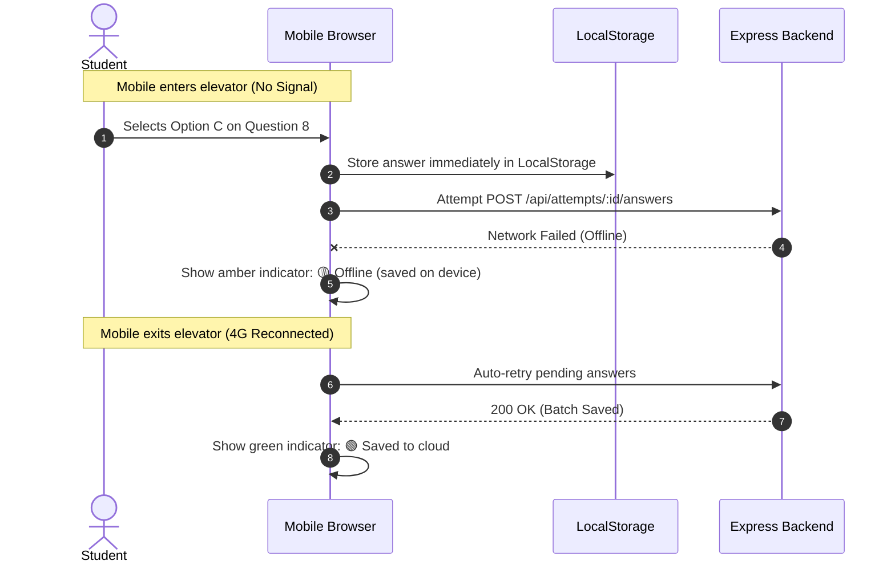

# Mobile Testing & Verification Guide

> **Secure Online MCQ Examination Platform**  
> A comprehensive guide for testing the platform on mobile devices, including local network setup, USB remote debugging, touch ergonomics, mobile-specific anti-cheating events, and offline resilience testing.

---

## 📑 Table of Contents

1. [Why Mobile Testing is Critical](#-why-mobile-testing-is-critical)
2. [Target Devices & Browser Matrix](#-target-devices--browser-matrix)
3. [Testing Methodologies](#-testing-methodologies)
   - [Method 1: DevTools Mobile Emulation (Fastest)](#method-1-devtools-mobile-emulation-fastest-inner-loop)
   - [Method 2: Physical Device on Local Wi-Fi (LAN)](#method-2-physical-device-on-local-wi-fi-lan)
   - [Method 3: USB Remote Debugging (Chrome DevTools on Mobile)](#method-3-usb-remote-debugging-chrome-devtools-on-mobile)
   - [Method 4: Secure HTTPS Tunneling (ngrok / Cloudflare)](#method-4-secure-https-tunneling-ngrok--cloudflare)
4. [Mobile Exam Interface & Touch UX Checklist](#-mobile-exam-interface--touch-ux-checklist)
5. [Mobile Anti-Cheating & Integrity Testing](#-mobile-anti-cheating--integrity-testing)
6. [Battery Saver & Background Throttling Resilience](#-battery-saver--background-throttling-resilience)
7. [Network Instability & Offline Auto-Recovery](#-network-instability--offline-auto-recovery)
8. [Mobile Testing Runbook (Step-by-Step Scenario)](#-mobile-testing-runbook-step-by-step-scenario)
9. [Troubleshooting Common Mobile Issues](#-troubleshooting-common-mobile-issues)

---

## 🎯 Why Mobile Testing is Critical

In institutional environments, a significant percentage of students access assessments through smartphones (Android and iOS). Mobile devices present unique technical constraints that do not exist on desktop computers:

1. **Dynamic Viewport Heights:** Mobile browsers show and hide URL address bars dynamically on scroll, altering viewport height (`100vh` vs `100dvh`).
2. **Aggressive Background Throttling:** When a mobile user switches apps or turns off the screen, mobile operating systems suspend or severely throttle JavaScript timers (`setInterval`).
3. **Accidental Touch Gestures:** Double-tapping can trigger browser zoom; pulling down can trigger pull-to-refresh; swiping from the edge can trigger browser back navigation.
4. **Touch Ergonomics:** Option selection cards and buttons must meet minimum touch target standards ($\ge 44 \times 44\text{px}$) to avoid mis-clicks.
5. **Mobile Integrity Detection:** App switching, notification shade pulldowns, split-screen multitasking, and incoming phone calls must be accurately tracked by integrity listeners.

---

## 📱 Target Devices & Browser Matrix

The examination interface is designed to support viewports from **360px** wide up to modern high-resolution phablets:

| Category | Device Examples | Viewport Width | Pixel Ratio (DPR) | Primary Browser |
|---|---|---|---|---|
| **Compact Android** | Samsung Galaxy A-series, Redmi 9/10 | 360px – 384px | 2.0x – 3.0x | Google Chrome, Samsung Internet |
| **Standard Android** | Google Pixel 7/8, Galaxy S22/S23 | 390px – 412px | 2.6x – 3.5x | Google Chrome, Brave |
| **Compact iOS** | iPhone SE (2nd/3rd Gen), iPhone 12/13 mini | 375px | 2.0x – 3.0x | Mobile Safari |
| **Standard iOS** | iPhone 13/14/15, iPhone 15 Pro | 390px – 393px | 3.0x | Mobile Safari, Chrome for iOS |
| **Large iOS / Plus** | iPhone 14/15 Plus, iPhone Pro Max | 428px – 430px | 3.0x | Mobile Safari |
| **Tablets / iPads** | iPad Air, Galaxy Tab | 768px – 820px | 2.0x | Mobile Safari, Chrome |

---

## 🔬 Testing Methodologies

### Method 1: DevTools Mobile Emulation (Fastest Inner Loop)

Use desktop browser emulation for rapid UI development and layout verification before deploying to physical hardware.

```
Desktop Chrome / Edge
  [ F12 ] -> Click "Toggle Device Toolbar" (Ctrl + Shift + M)
    ├── Select "iPhone 14 Pro" or "Pixel 7"
    ├── Set Zoom to 100%
    ├── Test Orientation: Portrait vs Landscape
    ├── Throttling: Test under "Fast 3G" and "Slow 3G"
    └── Emulate Touch: Cursor behaves as finger touch
```

#### Steps to Test:
1. Open `http://localhost:3000` in Google Chrome or Microsoft Edge.
2. Press `F12` (or right-click → **Inspect**).
3. Press `Ctrl + Shift + M` (macOS: `Cmd + Shift + M`) to toggle the **Device Toolbar**.
4. In the top dropdown, select **iPhone 14 Pro** or **Pixel 7**.
5. Test navigation to `/student/dashboard` and exam pages.
6. Under the **Throttling** dropdown, select **Fast 3G** to simulate mobile cellular latency.

---

### Method 2: Physical Device on Local Wi-Fi (LAN)

Test touch responsiveness, virtual keyboards, and real mobile browser rendering on your actual smartphone connected to the same Wi-Fi network as your development computer.



#### Step 1: Find Your Computer's Local IP Address
On your development machine:
- **Windows (PowerShell/CMD):**
  ```powershell
  ipconfig
  ```
  Look for **IPv4 Address** under your active Wi-Fi adapter (e.g., `192.168.1.15` or `10.0.0.42`).
- **macOS / Linux:**
  ```bash
  ifconfig | grep "inet " || ip a
  ```

#### Step 2: Start the Servers Bound to Local Network
Start both the backend and frontend. The frontend must bind to `0.0.0.0` so incoming connections from other devices are accepted:

```bash
# Terminal 1: Start Backend (Port 5000)
npm run dev:backend

# Terminal 2: Start Frontend with Mobile Network Access
npm run dev:mobile
```

*(Note: `npm run dev:mobile` executes `next dev -H 0.0.0.0`, allowing network devices on your Wi-Fi to connect).*

#### Step 3: Open on Your Smartphone
1. Connect your smartphone to the **exact same Wi-Fi network** as your computer.
2. Open Chrome (Android) or Safari (iOS).
3. Navigate to:
   ```
   http://<YOUR_PC_IP>:3000
   ```
   *(Example: `http://192.168.1.15:3000`)*

> [!TIP]
> **Zero Mobile Configuration:** The frontend client (`frontend/lib/api/client.ts`) uses relative API paths in the browser runtime. All API requests (`/api/*`) are automatically proxied by Next.js on your computer to the Express backend (`http://localhost:5000`), so your phone never needs direct access to port 5000!

---

### Method 3: USB Remote Debugging (Chrome DevTools on Mobile)

Connect an Android phone via USB cable to inspect live DOM elements, view console logs, and track network payloads on the real phone using your PC's desktop DevTools.

```
┌─────────────────────────────────┐           USB Cable           ┌───────────────────────────────┐
│     Android Smartphone          │ ───────────────────────────── │    Desktop Computer           │
│  - Running Chrome Mobile        │                               │  - Open chrome://inspect      │
│  - USB Debugging Enabled        │                               │  - Full DevTools Console & DOM│
└─────────────────────────────────┘                               └───────────────────────────────┘
```

#### For Android (Chrome):
1. **Enable USB Debugging on Phone:**
   - Go to **Settings** → **About Phone**.
   - Tap **Build Number** 7 times to enable Developer Options.
   - Go to **Settings** → **Developer Options** → Enable **USB Debugging**.
2. **Connect via USB:**
   - Plug phone into PC. Accept the "Allow USB debugging?" prompt on phone.
3. **Open Chrome Inspect on PC:**
   - In desktop Chrome, open: `chrome://inspect/#devices`.
   - Your connected phone will appear under **Remote Target**.
4. **Port Forwarding (Bonus - Access as `localhost:3000` on Phone!):**
   - In `chrome://inspect`, click **Port forwarding...**
   - Add rule: Port `3000` $\to$ `localhost:3000`. Check **Enable port forwarding**.
   - Now on your phone, you can simply type `http://localhost:3000`!
5. Click **Inspect** to see the phone screen mirrored with full DevTools console, elements, and network tabs.

#### For iOS (Safari):
1. On iPhone: **Settings** → **Safari** → **Advanced** → Enable **Web Inspector**.
2. Connect iPhone to Mac with USB cable.
3. Open Safari on Mac: **Develop** menu → Select your iPhone → Select the open tab.

---

### Method 4: Secure HTTPS Tunneling (ngrok / Cloudflare)

When testing features that strictly require HTTPS (such as the Fullscreen API or PWA installation), or when testing over cellular data (4G/5G) outside the local Wi-Fi network:

```bash
# Using ngrok (free)
npx ngrok http 3000
```

- ngrok gives you a secure public URL: `https://xxxx-xx-xx.ngrok-free.app`.
- Open this HTTPS URL directly on any mobile device anywhere in the world.

---

## 🎨 Mobile Exam Interface & Touch UX Checklist

Ensure the exam engine adheres to mobile UX standards:

### 1. Viewport & Accidental Zoom Prevention
- [ ] **No Accidental Double-Tap Zoom:** Fast clicking on MCQ option cards should not trigger browser magnification. Add CSS rule to buttons:
  ```css
  button, .option-card {
    touch-action: manipulation;
  }
  ```
- [ ] **Prevent Elastic Pull-to-Refresh:** Pulling down on mobile Chrome or Safari should not accidentally reload the exam:
  ```css
  body.exam-mode {
    overscroll-behavior-y: contain;
  }
  ```
- [ ] **Disable Text Selection / Callouts:** Long-pressing question text should not trigger the operating system's copy/share lens:
  ```css
  .exam-question-container {
    -webkit-user-select: none;
    user-select: none;
    -webkit-touch-callout: none;
  }
  ```

### 2. Touch Target Ergonomics
- [ ] **Option Cards:** Minimum touch area of $48\text{px} \times 48\text{px}$ with at least $10\text{px}$ margin between options to prevent accidental taps.
- [ ] **Action Buttons:** "Previous", "Next", and "Submit" buttons have distinct color coding, full-width or large thumb-accessible positioning at the bottom of the screen.

### 3. Question Palette Mobile Drawer
On desktop screens, the question palette (1 to 25) sits in a sidebar. On mobile screens (<640px):
- [ ] The palette should collapse into a toggleable **Bottom Sheet** or **Slide-over Drawer** activated by a "Question Grid (18/25)" badge.
- [ ] The palette grid items should be at least $40\text{px} \times 40\text{px}$ buttons.

### 4. Sticky Header & Dynamic Viewport Height (`100dvh`)
- [ ] Use `height: 100dvh` (dynamic viewport height) rather than `100vh` so the UI does not jump when the mobile browser address bar appears or collapses.
- [ ] Countdown timer and test title remain permanently pinned to the top of the mobile screen.

---

## 🛡️ Mobile Anti-Cheating & Integrity Testing

Mobile operating systems handle multitasking differently than desktop OSs. Test these exact scenarios to verify integrity monitoring (Phase 10):

| Test Scenario | Action Performed on Phone | Expected System Behavior | Verified |
|---|---|---|:---:|
| **App Switch (WhatsApp / Google)** | Swipe up to home or switch to another app | `visibilitychange` fires (`state: hidden`). Warning modal displays upon return. Violation logged to server. | [ ] |
| **Notification Shade Pull** | Swipe down from top of phone to view notifications | Triggers `window.onblur`. Violation recorded. Warning modal shown. | [ ] |
| **Incoming Phone Call** | Call the test phone during an active exam | Phone call overlay triggers `window.onblur` and `visibilitychange`. Event logged as `window_blur`. | [ ] |
| **Split-Screen Multitasking (Android)** | Drag another app into split screen | Viewport dimensions contract sharply; `window.onblur` triggers. | [ ] |
| **Screen Lock / Power Button** | Press power button to lock phone, then unlock | Event triggers `visibilitychange`. On unlock, timer resynchronizes to backend `startedAt`. | [ ] |
| **Right-Click / Long-Press Context Menu** | Long press on question text or images | Context menu is prevented via `e.preventDefault()`. | [ ] |
| **Browser Tab Switch** | Open another tab in mobile Chrome/Safari | Triggers `visibilitychange`. Returns student to exam with warning modal. | [ ] |

---

## ⚡ Battery Saver & Background Throttling Resilience

Mobile operating systems (especially Android MIUI/OneUI and iOS) aggressively freeze or throttle JavaScript execution when a browser tab is in the background or when **Low Power Mode** is active.

### The Timer Vulnerability & Our Solution
- **The Vulnerability:** If the countdown timer relies on `remainingSeconds = remainingSeconds - 1` inside `setInterval(..., 1000)`, a student could background their phone for 10 minutes, and the local timer would only tick down 10 seconds!
- **Our Resilient Solution:** The timer always calculates remaining time against the server-verified start timestamp:
  $$\text{RemainingMs} = (\text{test.duration} \times 60 \times 1000) - (\text{Date.now()} - \text{new Date}(\text{attempt.startedAt}).\text{getTime()})$$

#### Test Procedure:
1. Start an exam on mobile with 10 minutes duration. Note the remaining time (e.g., 09:50).
2. Press the phone's Power button to lock the screen. Wait **2 minutes** on a real clock.
3. Unlock the phone and view the exam tab.
4. **Pass Criteria:** The timer must immediately display **07:50** (accurate real-world time elapsed), proving the student cannot cheat time by backgrounding the mobile browser.

---

## 📶 Network Instability & Offline Auto-Recovery

Mobile cellular networks frequently experience spotty reception, elevator drops, or Wi-Fi handoff disconnects. Test Phase 8 resilience:



#### Test Procedure:
1. On your phone, begin an exam.
2. Turn on **Airplane Mode** in phone settings.
3. Answer Question 5 and Question 6.
4. **Verify:**
   - Answers register visually on the screen immediately.
   - Status badge transitions to `🟡 Offline (saved on device)`.
   - No crash or modal blocking the student.
5. Turn off **Airplane Mode**. Wait 5 seconds.
6. **Verify:**
   - Status badge transitions to `🟢 Saved to cloud`.
   - Answers sync to the server without student needing to press refresh.

---

## 📋 Mobile Testing Runbook (Step-by-Step Scenario)

Follow this complete manual test runbook to validate a mobile exam release:

```
[1] Setup Check
    ├── Start backend: npm run dev:backend
    ├── Start mobile frontend: npm run dev:mobile
    └── Verify phone accesses http://<PC_IP>:3000

[2] Registration & Login Check
    ├── Open /register on mobile
    ├── Choose a username and enter your full name
    ├── Submit -> verify account is created and signed in immediately
    └── Verify redirect to /student/dashboard

[3] Pre-Exam Briefing Check
    ├── Select active test from dashboard
    ├── Check rules & system checklist display properly without scrolling glitches
    └── Click "Start Examination"

[4] Active Exam UX Check
    ├── Test tapping options A, B, C, D on 5 questions
    ├── Verify touch targets feel comfortable and responsive
    ├── Toggle question palette bottom sheet
    ├── Jump from question 2 to question 10
    └── Check sticky timer remains visible at top

[5] Mobile Anti-Cheating Check
    ├── Switch to WhatsApp for 3 seconds -> return
    ├── Confirm violation modal appears with count #1
    ├── Pull down notification shade -> return
    └── Confirm violation count increments to #2

[6] Background Time Check
    ├── Note time (e.g. 12:00)
    ├── Lock phone for 90 seconds
    └── Unlock -> confirm timer reflects 10:30 (elapsed accurately)

[7] Submission Check
    ├── Tap "Submit Exam"
    ├── Review mobile confirmation dialog (answered vs unanswered count)
    ├── Tap "Confirm & Submit"
    └── Verify immediate redirection to /student/results with score card
```

---

## 🛠 Troubleshooting Common Mobile Issues

### 1. Phone cannot connect to `http://<PC_IP>:3000`
- **Cause 1:** Computer and phone are on different Wi-Fi networks (e.g. PC on 5GHz, phone on Guest network).  
  *Fix:* Ensure both devices connect to the exact same Wi-Fi SSID.
- **Cause 2:** Windows Firewall is blocking incoming traffic on port 3000.  
  *Fix:* Run this in Administrator PowerShell to allow Node.js:
  ```powershell
  New-NetFirewallRule -DisplayName "NextJS Dev Server" -Direction Inbound -LocalPort 3000 -Protocol TCP -Action Allow
  ```
- **Cause 3:** Frontend was started without `-H 0.0.0.0`.  
  *Fix:* Run `npm run dev:mobile` instead of plain `npm run dev`.

### 2. Network error when clicking Login on mobile
- **Cause:** Frontend was calling `http://localhost:5000` directly. On a mobile phone, `localhost` points to the phone, not your computer!  
  *Fix:* Verify `frontend/lib/api/client.ts` uses empty `API_BASE = ""` in the browser runtime so Next.js proxies the call.

### 3. Page zooms in when tapping an input field (iOS Safari)
- **Cause:** iOS Safari automatically zooms in on any `<input>` element with `font-size` smaller than `16px`.  
  *Fix:* Ensure all inputs have `font-size: 16px` (or `text-base` in Tailwind CSS) on mobile viewports.
