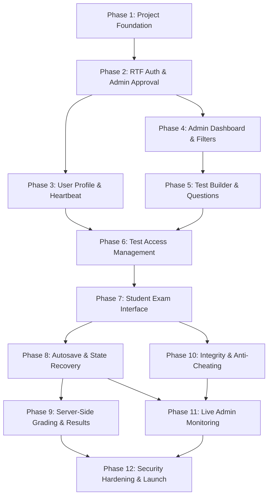
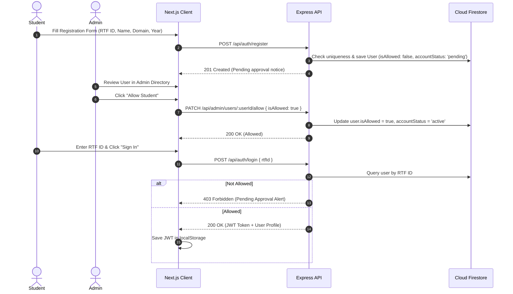
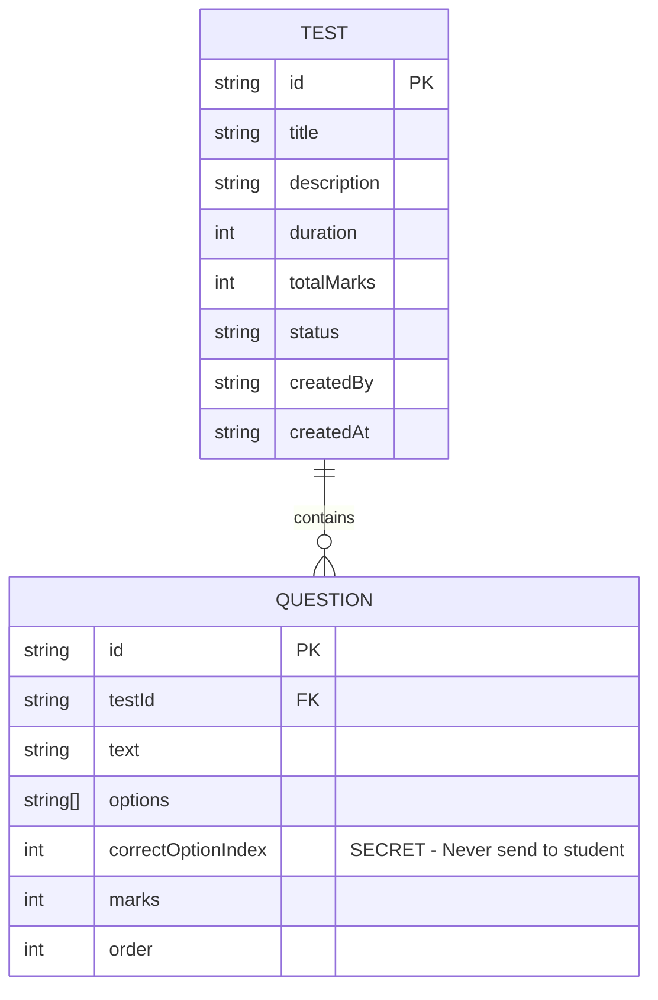
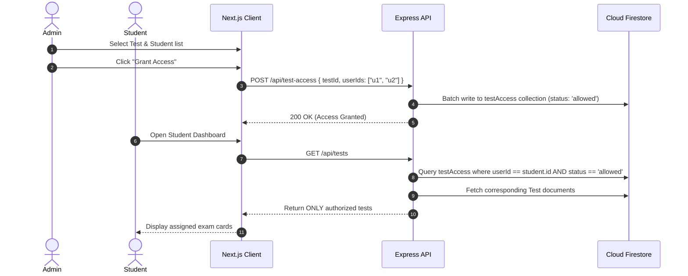
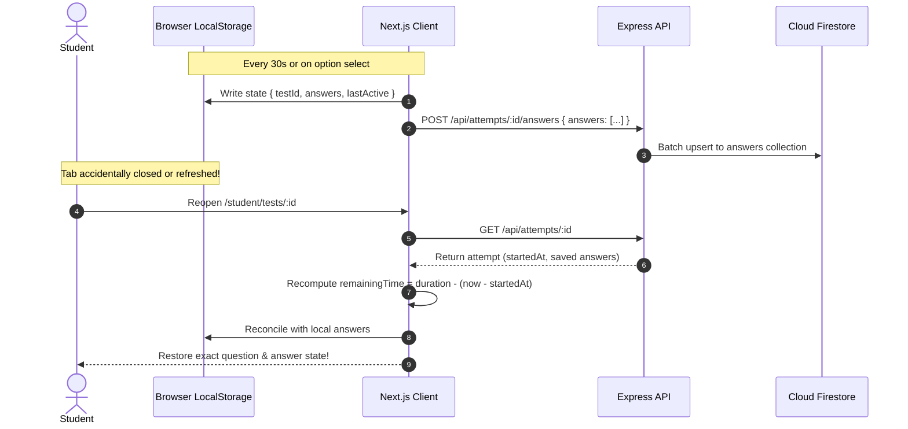
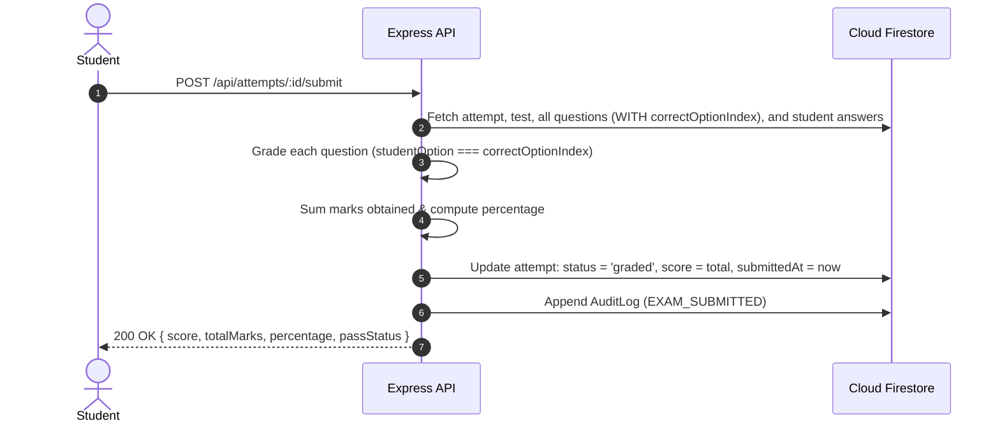
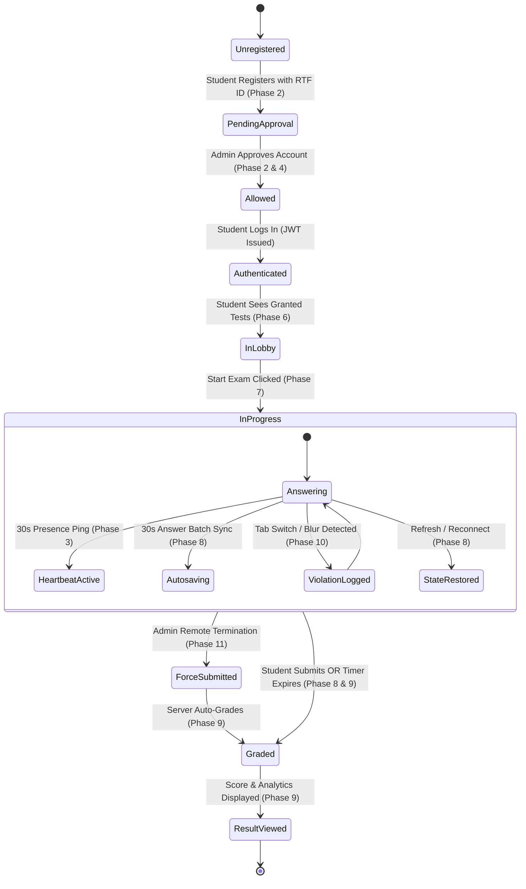

# Step-by-Step Implementation Guide

> **Secure Online MCQ Examination Platform**  
> A comprehensive, phase-by-phase implementation manual detailing architectural flows, backend services, frontend components, API contracts, security safeguards, and testing protocols for all 12 development phases.

---

## 📑 Table of Contents

1. [Architectural Principles & Global Standards](#-architectural-principles--global-standards)
2. [Phase Dependency Matrix](#-phase-dependency-matrix)
3. [Phase 1: Project Foundation (Completed)](#phase-1--project-foundation--completed)
4. [Phase 2: RTF ID Authentication & Admin Approval (Completed)](#phase-2--rtf-id-authentication--admin-approval--completed)
5. [Phase 3: User Management & Presence Heartbeat](#phase-3--user-management--presence-heartbeat)
6. [Phase 4: Admin Dashboard & User Management](#phase-4--admin-dashboard--user-management)
7. [Phase 5: Test Builder & Question Bank](#phase-5--test-builder--question-bank)
8. [Phase 6: Test Access Management](#phase-6--test-access-management)
9. [Phase 7: Student Exam Interface & Exam Engine](#phase-7--student-exam-interface--exam-engine)
10. [Phase 8: Timer, Autosave, and State Recovery](#phase-8--timer-autosave-and-state-recovery)
11. [Phase 9: Server-Side Grading and Results](#phase-9--server-side-grading-and-results)
12. [Phase 10: Anti-Cheating & Integrity Monitoring](#phase-10--anti-cheating--integrity-monitoring)
13. [Phase 11: Live Admin Monitoring & Remote Actions](#phase-11--live-admin-monitoring--remote-actions)
14. [Phase 12: Security Hardening, Testing & Launch](#phase-12--security-hardening-testing--launch)
15. [End-to-End Examination Lifecycle Walkthrough](#-end-to-end-examination-lifecycle-walkthrough)
16. [Branching, Verification & Quality Assurance](#-branching-verification--quality-assurance)

---

## 🏛 Architectural Principles & Global Standards

Before beginning work on any phase, all contributors must observe these core engineering rules:

1. **Zero Client-Side Secrets:** Client code (`frontend/`) must never import Firebase Admin SDK, service account keys, or JWT signing secrets. All database mutations and sensitive queries must route through the Express REST API (`backend/`).
2. **Server-Authoritative Evaluation:** The client device is untrusted. Examination answer keys (`correctOptionIndex`), timer validation, access authorization, and grading must happen on the backend.
3. **Mobile-First Student UX:** Student exam interfaces (`frontend/app/student/*`) must render fluidly on mobile viewports (360px–420px width) as well as desktop screens.
4. **Resilient Offline/Degraded Connectivity:** Student answers and timer states must persist in browser storage (`localStorage`) and sync opportunistically to the backend to prevent data loss.
5. **Immutable Audit Trails:** Destructive or privilege-sensitive actions (approvals, force-submits, access grants, violations) must generate append-only audit records.

---

## 🗺 Phase Dependency Matrix



---

## Phase 1 — Project Foundation (✅ Completed)

### 1. Objective
Establish the monorepo structure, build systems, TypeScript configurations, environment templates, Express REST API skeleton, Next.js 15 App Router frontend, and documentation suite.

### 2. Implementation Summary
- Initialized `frontend/` (Next.js 15, App Router, TypeScript, vanilla CSS design system).
- Initialized `backend/` (Express 5, TypeScript, Helmet, CORS, Firebase Admin SDK wrapper).
- Configured data models in `backend/src/types/models.ts` and shared interfaces in `frontend/types/index.ts`.
- Configured `frontend/lib/api/client.ts` with direct fallback proxying to `http://localhost:5000`.
- Added baseline documentation (`api.md`, `architecture.md`, `database.md`, `team-modules.md`, `development-phases.md`).

---

## Phase 2 — RTF ID Authentication & Admin Approval (✅ Completed)

### 1. Objective
Enable students to register and log in using an institutional RTF ID without third-party email/password or client Firebase dependencies. Enforce an administrative approval gate (`isAllowed: true`) before granting platform access.

### 2. Architecture & Data Flow



### 3. Verification & Acceptance
- Registered student with ID `RTF2026001`.
- Attempted login immediately → Blocked with HTTP 403 and informative pending status alert.
- Admin logged in (`ADMIN001`) and clicked "Allow" → Student status transitioned to `Allowed`.
- Student logged in again → Successfully issued JWT and redirected to student dashboard.

---

## Phase 3 — User Management & Presence Heartbeat

### 1. Objective
Allow logged-in students to load their verified profile data and transmit regular presence pings (heartbeats) to the backend to keep their `lastSeen` timestamp up to date for real-time monitoring.

### 2. Module Ownership
- **Lead:** Team Member 1 (Auth & User Management)
- **Files Involved:**
  - `backend/src/routes/userRoutes.ts`
  - `backend/src/controllers/userController.ts`
  - `backend/src/services/userService.ts`
  - `frontend/hooks/useHeartbeat.ts` *(new)*
  - `frontend/hooks/useAuth.ts` *(new)*
  - `frontend/app/student/dashboard/page.tsx`

### 3. Step-by-Step Implementation Workflow

#### Step 3.1: Backend Service & Route Implementation
1. **Verify `GET /api/users/me` Controller:**
   - Extract `req.user.id` injected by `authMiddleware`.
   - Query Firestore `users/{userId}` or in-memory fallback.
   - Return clean profile payload omitting server-only fields.
2. **Verify `POST /api/users/heartbeat` Controller:**
   - On each call, update the student's `lastSeen` attribute to the current ISO 8601 timestamp (`new Date().toISOString()`).
   - Return `{ success: true, timestamp: string }`.

#### Step 3.2: Frontend Heartbeat Hook (`frontend/hooks/useHeartbeat.ts`)
Create a custom React hook that runs automatically when a student is on an active platform page:
```typescript
// frontend/hooks/useHeartbeat.ts
import { useEffect } from "react";
import { usersApi } from "@/lib/api/endpoints";
import { getAuthToken } from "@/lib/api/client";

export function useHeartbeat(intervalMs: number = 30000) {
  useEffect(() => {
    const token = getAuthToken();
    if (!token) return;

    // Send initial heartbeat immediately
    usersApi.heartbeat().catch(() => {});

    // Schedule recurring pings
    const interval = setInterval(() => {
      usersApi.heartbeat().catch((err) => {
        console.warn("Heartbeat ping failed:", err);
      });
    }, intervalMs);

    return () => clearInterval(interval);
  }, [intervalMs]);
}
```

#### Step 3.3: Student Dashboard Profile Card (`frontend/app/student/dashboard/page.tsx`)
- Mount `useHeartbeat(30000)`.
- On page load, invoke `usersApi.me()`.
- Display a profile overview card:
  - Student Name & RTF ID
  - Registered Domain & Branch
  - Passing Year
  - Current System Status: `Active / Verified`
  - Current active connection indicator (Green pulsing badge)

### 4. Verification & Testing
```bash
# 1. Fetch current profile
curl -X GET http://localhost:5000/api/users/me \
  -H "Authorization: Bearer <STUDENT_JWT>"

# 2. Transmit heartbeat
curl -X POST http://localhost:5000/api/users/heartbeat \
  -H "Authorization: Bearer <STUDENT_JWT>"
```
- **Check:** Confirm `lastSeen` updates in Firestore or the local user state.
- **Check:** Open browser DevTools Network tab on `/student/dashboard`; confirm a `POST /api/users/heartbeat` fires every 30 seconds.

---

## Phase 4 — Admin Dashboard & User Management

### 1. Objective
Equip administrators with a control room to view, search, filter, and moderate all student accounts. Calculate real-time online/offline presence using the delta between current time and `lastSeen`.

### 2. Module Ownership
- **Lead:** Team Member 2 (Admin Dashboard & Test Access)
- **Files Involved:**
  - `backend/src/controllers/adminController.ts`
  - `backend/src/services/userService.ts`
  - `frontend/app/admin/users/page.tsx`
  - `frontend/app/admin/dashboard/page.tsx`

### 3. Step-by-Step Implementation Workflow

#### Step 4.1: Presence Logic & Advanced Querying in Backend
1. **Online/Offline Threshold Definition:**
   - Define presence window in `backend/src/config/constants.ts`:
     ```typescript
     export const PRESENCE_THRESHOLD_MS = 60 * 1000; // 60 seconds
     ```
   - An account is considered `online` if `Date.now() - new Date(user.lastSeen).getTime() <= PRESENCE_THRESHOLD_MS`.
2. **Update `GET /api/admin/users`:**
   - Support query parameters: `search`, `status`, `domain`, `yearOfPassing`, `presence` (`online` | `offline`).
   - Apply filters sequentially to the Firestore query or memory cache.
   - Return decorated user objects containing computed `isOnline: boolean`.

#### Step 4.2: User Status Management Endpoints
- Implement `PATCH /api/admin/users/:userId/status`:
  - Body: `{ status: "active" | "pending" | "rejected" | "blocked" }`
  - Updates `user.accountStatus`.
  - Emits an `AuditLog` entry: `USER_STATUS_CHANGED`.

#### Step 4.3: Admin Directory UI Enhancements (`frontend/app/admin/users/page.tsx`)
- Add filter controls:
  - Search input (RTF ID, student name, email)
  - Status dropdown (`All`, `Pending Approval`, `Allowed`, `Blocked`)
  - Presence dropdown (`All`, `Online Now`, `Offline`)
- Add bulk actions:
  - "Approve All Pending" button
  - Export student directory to CSV

### 4. Verification & Testing
1. Log in as a student in a private browsing window to start heartbeat pings.
2. In the Admin Dashboard (`/admin/users`), verify that the student shows a green `Online` indicator.
3. Close the student window. Wait 65 seconds and refresh the admin directory.
4. Verify the student indicator transitions to `Offline`.

---

## Phase 5 — Test Builder & Question Bank

### 1. Objective
Allow administrators to author tests, configure test metadata (duration, total marks, scheduled times), add 4-option MCQ questions with designated correct answers, and manage the test lifecycle (`draft` → `scheduled` → `active` → `completed`).

> [!IMPORTANT]
> **Data Isolation Rule:** When students query `/api/tests` or `/api/tests/:id`, the backend **must strip** `correctOptionIndex` from every question object. Only administrators may receive the answer key.

### 2. Architecture & Data Model



### 3. Step-by-Step Implementation Workflow

#### Step 5.1: Backend Data Service (`backend/src/services/testService.ts`)
1. Create `testService.ts` with operations:
   - `createTest(testData, adminId)`
   - `getTestById(testId, isAdmin)`: If `isAdmin === false`, omit `correctOptionIndex` from questions.
   - `updateTest(testId, updateData)`
   - `deleteTest(testId)`
   - `addQuestionToTest(testId, questionData)`
   - `updateQuestion(questionId, updateData)`
   - `deleteQuestion(questionId)`

#### Step 5.2: Backend Controllers & Validation (`backend/src/controllers/testController.ts`)
1. Implement Zod schema in `backend/src/validators/testValidator.ts`:
   ```typescript
   export const createTestSchema = z.object({
     title: z.string().min(3).max(100),
     description: z.string().optional(),
     duration: z.number().int().min(5).max(300),
     totalMarks: z.number().int().min(1),
   });

   export const questionSchema = z.object({
     text: z.string().min(5),
     options: z.array(z.string()).length(4),
     correctOptionIndex: z.number().int().min(0).max(3),
     marks: z.number().int().min(1).default(1),
     order: z.number().int().min(1),
   });
   ```
2. Bind routes in `backend/src/routes/testRoutes.ts`:
   - `POST /api/tests` (Admin only)
   - `GET /api/tests` (Authenticated: returns all tests for admin, accessible tests for students)
   - `GET /api/tests/:id` (Authenticated: question list sanitized based on role)
   - `PUT /api/tests/:id` (Admin only)
   - `DELETE /api/tests/:id` (Admin only)
   - `POST /api/tests/:id/questions` (Admin only)
   - `DELETE /api/tests/:id/questions/:questionId` (Admin only)

#### Step 5.3: Admin Test Builder UI (`frontend/app/admin/tests/page.tsx`)
1. **Test Overview Tab:**
   - Table of existing tests with status badges (`draft`, `scheduled`, `active`, `completed`).
   - "Create New Test" modal with fields: Title, Description, Duration (minutes), Total Marks.
2. **Question Editor Component (`frontend/components/admin/QuestionEditor.tsx`):**
   - Question text input with rich formatting or code snippet support.
   - 4 Option inputs labeled (A, B, C, D).
   - Radio selector to designate the correct option index (0 to 3).
   - Marks weight input (defaults to 1).
   - Live question counter and cumulative marks tally.

### 4. Verification & Testing
```bash
# Create test as Admin
curl -X POST http://localhost:5000/api/tests \
  -H "Authorization: Bearer <ADMIN_JWT>" \
  -H "Content-Type: application/json" \
  -d '{"title": "Computer Networks Quiz", "duration": 30, "totalMarks": 10}'

# Fetch test as Student — ensure correctOptionIndex is NOT present
curl -X GET http://localhost:5000/api/tests/<TEST_ID> \
  -H "Authorization: Bearer <STUDENT_JWT>"
```
- **Check:** Confirm the student response JSON does **not** contain the `correctOptionIndex` field anywhere.

---

## Phase 6 — Test Access Management

### 1. Objective
Allow administrators to grant or revoke student access to specific tests individually or by batch (domain, passing year, branch). Ensure students only see and start tests for which they hold an active `allowed` record.

### 2. Architecture & Access Flow



### 3. Step-by-Step Implementation Workflow

#### Step 6.1: Backend Service (`backend/src/services/testAccessService.ts`)
1. Create `testAccessService.ts` methods:
   - `grantAccess(testId, userId, adminId)`: Creates or updates `testAccess` record to `status: "allowed"`.
   - `batchGrantAccess(testId, userIds, adminId)`: Executes a batch write in Firestore.
   - `revokeAccess(accessId, adminId)`: Updates record to `status: "revoked"`, `revokedAt: new Date().toISOString()`.
   - `getStudentAccessibleTests(userId)`: Joins `testAccess` records with `tests` collection.
   - `checkStudentTestAccess(userId, testId)`: Returns boolean confirming whether the student has valid permission.

#### Step 6.2: Route & Controller Binding (`backend/src/controllers/testAccessController.ts`)
- `POST /api/test-access`: Accepts `{ testId, userIds: string[] }` or criteria `{ domain, yearOfPassing }`.
- `DELETE /api/test-access/:id`: Revokes access for a specific grant.
- `GET /api/test-access/test/:testId`: Returns all access grants for a given test (Admin only).

#### Step 6.3: Admin Access Manager UI (`frontend/app/admin/access/page.tsx`)
- Dropdown to select a test.
- Filterable student selection table:
  - Checkboxes for individual student selection.
  - "Select by Domain" (e.g., Cloud, AI/ML, Full Stack).
  - "Select by Passing Year" (e.g., 2026, 2027).
- Action buttons: "Grant Access (X students)" and "Revoke Access".
- Access list displaying student name, RTF ID, granted date, and status pill.

### 4. Verification & Testing
1. Create Test 1 and Test 2.
2. Grant Student A access to Test 1 only.
3. Log in as Student A → Confirm only Test 1 appears on `/student/dashboard`.
4. Directly attempt `GET /api/tests/<TEST_2_ID>` as Student A → Expect `403 Forbidden: You do not have access to this test`.

---

## Phase 7 — Student Exam Interface & Exam Engine

### 1. Objective
Provide a focused, distraction-free, mobile-first examination interface where students read questions, select options, navigate between questions, track remaining time, and submit responses with confirmation.

### 2. UI Layout Specification

```
┌─────────────────────────────────────────────────────────────┐
│ 🛡️ Secure Exam: Cloud Computing Mid-Term     ⏱️ 28:45 Left │
├──────────────────────────────────┬──────────────────────────┤
│ Question 4 of 25                 │ Question Palette         │
│                                  │ [1] [2] [3] (4) [5]      │
│ Which AWS service is serverless? │ [6] [7] [8] [9] [10]     │
│                                  │                          │
│  ○ A) Amazon EC2                 │ Legend:                  │
│  ◉ B) AWS Lambda                 │ 🟢 Answered (3)          │
│  ○ C) Amazon EBS                 │ ⚪ Unanswered (21)       │
│  ○ D) Amazon VPC                 │ 🔵 Current (1)           │
│                                  │                          │
│ [ ‹ Previous ]    [ Next › ]     │ [ 🏁 Submit Exam ]       │
└──────────────────────────────────┴──────────────────────────┘
```

### 3. Step-by-Step Implementation Workflow

#### Step 7.1: Attempt Initialization (`backend/src/controllers/attemptController.ts`)
1. Implement `POST /api/attempts`:
   - Validates that student has `allowed` status in `testAccess`.
   - Checks if an active attempt already exists (`status: "in_progress"`).
   - If not, creates new `testAttempt` document:
     ```typescript
     {
       id: generateId(),
       testId,
       userId: req.user.id,
       status: "in_progress",
       startedAt: new Date().toISOString(),
       submittedAt: null,
       score: null
     }
     ```
   - Returns the attempt ID and sanitized question payload.

#### Step 7.2: Exam Instructions Page (`frontend/app/student/tests/[id]/page.tsx`)
- Renders pre-exam briefing:
  - Test Title, Total Questions, Time Limit, Rules.
  - System checks banner (Browser compatibility, fullscreen capability).
  - Explicit warning about tab switches and integrity monitoring.
  - "Start Examination" CTA button.

#### Step 7.3: Exam Engine Components
1. **`QuestionCard.tsx`:**
   - Displays question number, question text, and 4 styled clickable option cards.
   - Supports keyboard hotkeys (`1`, `2`, `3`, `4` or `A`, `B`, `C`, `D`).
   - Clear visual indicator for the active selected option.
2. **`QuestionPalette.tsx`:**
   - Grid of question numbers allowing instant jumping to any question.
   - Color coded: Green (Answered), Gray (Unanswered), Purple outline (Active).
3. **`SubmitModal.tsx`:**
   - Summary modal: `You have answered 22 of 25 questions. Are you sure you want to finish?`
   - Explicit "Confirm & Submit" vs "Return to Exam" buttons.

### 4. Verification & Testing
- Student clicks "Start Exam" → Check Firestore `testAttempts` has an `in_progress` record.
- Student clicks options and navigates through questions 1 to 5.
- Confirm selection persists in local state when navigating forward and backward.

---

## Phase 8 — Timer, Autosave, and State Recovery

### 1. Objective
Ensure zero data loss during network disruptions, accidental tab closures, or browser refreshes. Maintain an accurate countdown timer synchronized with backend timestamps and trigger automated submission upon expiry.

### 2. State Recovery Flow



### 3. Step-by-Step Implementation Workflow

#### Step 8.1: Server-Authoritative Timer Calculation
- **Never trust client remaining time:** The backend computes remaining time as:
  $$\text{RemainingMs} = (\text{test.duration} \times 60 \times 1000) - (\text{Date.now()} - \text{new Date}(\text{attempt.startedAt}).\text{getTime()})$$
- If $\text{RemainingMs} \le 0$, the attempt is expired and must reject further answer saves.

#### Step 8.2: Batch Answer Autosave Endpoint
- Route: `POST /api/attempts/:id/answers`
- Request body:
  ```json
  {
    "answers": [
      { "questionId": "q1", "selectedOptionIndex": 1 },
      { "questionId": "q2", "selectedOptionIndex": 3 }
    ]
  }
  ```
- Backend validates attempt status is `in_progress`, then batch upserts documents into `answers/{attemptId}_{questionId}`.

#### Step 8.3: Client Autosave & LocalStorage Cache Hook (`frontend/hooks/useExamAutosave.ts`)
- Maintains dual-layer persistence:
  1. Synchronous update to `localStorage.getItem("exam_answers_" + attemptId)` on every option click.
  2. Debounced / periodic POST to `/api/attempts/:id/answers` every 30 seconds.
- Displays subtle saving indicator in header: `🟢 Saved to cloud` / `🟡 Saving...` / `🔴 Offline (saved locally)`.

#### Step 8.4: Auto-Submit on Timer Expiry
- When timer reaches `00:00`:
  - Disable all option buttons.
  - Display non-dismissible modal: `Time Expired! Submitting your answers...`
  - Trigger `POST /api/attempts/:id/submit`.
  - Redirect to results page upon resolution.

### 4. Verification & Testing
1. Start an exam and answer Questions 1, 2, and 3.
2. Force-refresh the browser tab (`F5` or `Ctrl+R`).
3. **Verify:**
   - The countdown timer resumes from the correct remaining time.
   - Questions 1, 2, and 3 retain their selected answers.
4. Simulate network disconnect (DevTools Offline mode):
   - Answer Question 4.
   - Confirm answer is saved to `localStorage` and status indicates offline.
   - Re-enable network → Confirm sync fires automatically.

---

## Phase 9 — Server-Side Grading and Results

### 1. Objective
Execute deterministic, tamper-proof grading on the backend immediately upon submission. Compute total score, percentage, correct/incorrect totals, and present an instant score breakdown to the student.

### 2. Grading Architecture



### 3. Step-by-Step Implementation Workflow

#### Step 9.1: Server-Side Grading Service (`backend/src/services/gradingService.ts`)
```typescript
export interface GradingResult {
  attemptId: string;
  totalQuestions: number;
  attemptedQuestions: number;
  correctQuestions: number;
  incorrectQuestions: number;
  score: number;
  totalMarks: number;
  percentage: number;
}

export async function gradeAttempt(attemptId: string): Promise<GradingResult> {
  // 1. Fetch attempt and verify it is not already graded
  const attempt = await getAttemptById(attemptId);
  if (attempt.status === "graded") {
    throw new Error("Attempt has already been graded.");
  }

  // 2. Fetch all test questions (including correctOptionIndex)
  const questions = await getQuestionsByTestId(attempt.testId, true);
  
  // 3. Fetch all student answers for this attempt
  const answers = await getAnswersByAttemptId(attemptId);
  const answerMap = new Map(answers.map((a) => [a.questionId, a.selectedOptionIndex]));

  let score = 0;
  let correctQuestions = 0;
  let totalMarks = 0;

  for (const q of questions) {
    totalMarks += q.marks;
    const selected = answerMap.get(q.id);
    if (selected !== undefined && selected === q.correctOptionIndex) {
      score += q.marks;
      correctQuestions++;
    }
  }

  const attemptedQuestions = answers.filter((a) => a.selectedOptionIndex !== null).length;
  const percentage = totalMarks > 0 ? Math.round((score / totalMarks) * 100) : 0;

  // 4. Update attempt document in Firestore
  await updateAttemptRecord(attemptId, {
    status: "graded",
    score,
    gradedAt: new Date().toISOString(),
    submittedAt: attempt.submittedAt || new Date().toISOString(),
  });

  return {
    attemptId,
    totalQuestions: questions.length,
    attemptedQuestions,
    correctQuestions,
    incorrectQuestions: attemptedQuestions - correctQuestions,
    score,
    totalMarks,
    percentage,
  };
}
```

#### Step 9.2: Student Result View (`frontend/app/student/results/page.tsx`)
- Displays celebratory or completion banner.
- Metric cards:
  - Total Score (`18 / 20`)
  - Percentage score pill (`90%`)
  - Accuracy breakdown (Answered, Correct, Incorrect, Skipped)
  - Time taken
- "Back to Dashboard" button.

### 4. Verification & Testing
1. Create a 3-question test (Option keys: Q1=0, Q2=1, Q3=2, 1 mark each).
2. Submit attempt with answers: Q1=0, Q2=1, Q3=0.
3. Call `POST /api/attempts/:id/submit`.
4. **Verify:** Response returns `score: 2`, `totalMarks: 3`, `percentage: 67%`.
5. Check Firestore: `attempt.status` is set to `"graded"`.

---

## Phase 10 — Anti-Cheating & Integrity Monitoring

### 1. Objective
Detect, warn, and log browser-level integrity violations during an active exam (tab switching, window blurring, exiting fullscreen, right-clicking, copy-pasting, restricted keyboard shortcuts) to uphold test credibility.

> [!WARNING]
> **Integrity Disclaimer:** Browser-based monitoring detects client-side events. It cannot prevent physical multi-device usage, hardware capture cards, or external AI assistants. It serves as an audit and deterrent system.

### 2. Violations Monitored

| Event Code | Trigger Event | Severity | Action Taken |
|---|---|---|---|
| `tab_switch` | `document.visibilityState === 'hidden'` | High | Warning dialog + Server violation log |
| `window_blur` | `window.onblur` | Medium | Warning alert + Server violation log |
| `fullscreen_exit` | `document.fullscreenElement === null` | High | Re-prompt fullscreen + Violation log |
| `context_menu` | `window.oncontextmenu` | Low | Action blocked (`e.preventDefault()`) |
| `copy_attempt` | `document.oncopy` | Low | Action blocked (`e.preventDefault()`) |
| `paste_attempt` | `document.onpaste` | Low | Action blocked (`e.preventDefault()`) |
| `keyboard_shortcut` | `Ctrl+C`, `Ctrl+V`, `Alt+Tab`, `F12` | Medium | Action blocked + Violation log |

### 3. Step-by-Step Implementation Workflow

#### Step 3.1: Integrity Hook (`frontend/hooks/useExamIntegrity.ts`)
```typescript
import { useEffect, useRef } from "react";
import { apiRequest } from "@/lib/api/client";

interface IntegrityOptions {
  attemptId: string;
  onViolationWarning: (message: string, count: number) => void;
  maxViolationsAllowed?: number;
}

export function useExamIntegrity({
  attemptId,
  onViolationWarning,
  maxViolationsAllowed = 5,
}: IntegrityOptions) {
  const violationCountRef = useRef(0);

  const logViolation = async (type: string, metadata: Record<string, unknown> = {}) => {
    violationCountRef.current += 1;
    const count = violationCountRef.current;

    // Notify student on screen
    onViolationWarning(
      `Warning: Browser violation detected (${type.replace("_", " ")}). Event #${count}.`,
      count
    );

    // Transmit to backend
    await apiRequest("/api/violations", {
      method: "POST",
      body: { attemptId, type, metadata, timestamp: new Date().toISOString() },
    });
  };

  useEffect(() => {
    // 1. Tab switch detection
    const handleVisibilityChange = () => {
      if (document.visibilityState === "hidden") {
        logViolation("tab_switch");
      }
    };

    // 2. Window blur detection
    const handleBlur = () => {
      logViolation("window_blur");
    };

    // 3. Block right-click context menu
    const handleContextMenu = (e: MouseEvent) => {
      e.preventDefault();
      logViolation("context_menu");
    };

    // 4. Block copy / paste
    const handleCopy = (e: ClipboardEvent) => e.preventDefault();
    const handlePaste = (e: ClipboardEvent) => e.preventDefault();

    // 5. Block restricted shortcut keys (F12, Ctrl+C, Ctrl+V, Ctrl+U)
    const handleKeyDown = (e: KeyboardEvent) => {
      if (
        e.key === "F12" ||
        ((e.ctrlKey || e.metaKey) && ["c", "v", "u", "s"].includes(e.key.toLowerCase()))
      ) {
        e.preventDefault();
        logViolation("keyboard_shortcut", { key: e.key });
      }
    };

    document.addEventListener("visibilitychange", handleVisibilityChange);
    window.addEventListener("blur", handleBlur);
    window.addEventListener("contextmenu", handleContextMenu);
    window.addEventListener("copy", handleCopy);
    window.addEventListener("paste", handlePaste);
    window.addEventListener("keydown", handleKeyDown);

    return () => {
      document.removeEventListener("visibilitychange", handleVisibilityChange);
      window.removeEventListener("blur", handleBlur);
      window.removeEventListener("contextmenu", handleContextMenu);
      window.removeEventListener("copy", handleCopy);
      window.removeEventListener("paste", handlePaste);
      window.removeEventListener("keydown", handleKeyDown);
    };
  }, [attemptId]);
}
```

#### Step 3.2: Backend Violation Receiver (`backend/src/controllers/violationController.ts`)
- Endpoint: `POST /api/violations`
- Inserts document into `violations` collection.
- Checks cumulative violation count for `attemptId`.
- If count exceeds institutional threshold (e.g. 10 violations), can flag attempt as `flagged_for_review`.

### 4. Verification & Testing
1. Start an exam in Chrome.
2. Open a new tab or switch windows (`Alt+Tab`).
3. Return to the exam tab.
4. **Verify:** A warning banner/modal appears informing the student of the violation.
5. Query `GET /api/admin/violations/<attemptId>` as Admin → Confirm the violation is logged with exact timestamp.

---

## Phase 11 — Live Admin Monitoring & Remote Actions

### 1. Objective
Provide administrators with a real-time command dashboard showing all active examination sessions, live student heartbeats, running timers, accumulated violations, and the ability to remotely force-submit a compromised exam.

### 2. Live Monitor UI Layout

```
┌────────────────────────────────────────────────────────────────────────────┐
│ 📡 Live Exam Monitor: Cloud Computing Mid-Term (14 Students Active)        │
├──────────────┬─────────────┬──────────┬────────────┬───────────┬───────────┤
│ Student      │ RTF ID      │ Presence │ Progress   │ Violations│ Actions   │
├──────────────┼─────────────┼──────────┼────────────┼───────────┼───────────┤
│ John Doe     │ RTF2026011  │ 🟢 Active│ 18/25 (72%)│ 0 Clean   │ [Detail]  │
│ Sarah Connor │ RTF2026042  │ 🟢 Active│ 12/25 (48%)│ ⚠️ 4 Tabs │ [Force ⚡]│
│ Alex Murphy  │ RTF2026089  │ 🔴 3m ago│ 5/25 (20%) │ 0 Clean   │ [Detail]  │
└──────────────┴─────────────┴──────────┴────────────┴───────────┴───────────┘
```

### 3. Step-by-Step Implementation Workflow

#### Step 11.1: Live Monitor Aggregation Endpoint
- Endpoint: `GET /api/admin/monitoring/active`
- Query logic:
  1. Fetch all `testAttempts` where `status == "in_progress"`.
  2. Join student details (`name`, `rtfId`, `lastSeen`).
  3. Aggregate answer count for each attempt.
  4. Aggregate count of violations grouped by `attemptId`.
  5. Return consolidated real-time array.

#### Step 11.2: Remote Force-Submit Implementation
- Endpoint: `POST /api/admin/attempts/:id/force-submit`
- Controller logic:
  1. Verify requester holds `admin` or `superadmin` role.
  2. Update attempt status to `"force_submitted"`.
  3. Immediately invoke `gradeAttempt(attemptId)` to lock in answers collected so far.
  4. Write `AuditLog` entry:
     ```typescript
     {
       action: "EXAM_FORCE_SUBMITTED",
       entityType: "attempt",
       entityId: attemptId,
       userId: req.user.id,
       metadata: { reason: req.body.reason || "Excessive integrity violations" }
     }
     ```
  5. On the student side, the next autosave or heartbeat ping receives `{ status: "force_submitted" }` and immediately terminates the exam interface.

### 4. Verification & Testing
1. Student starts exam in Tab A.
2. Admin opens `/admin/attempts` in Tab B.
3. Admin clicks "Force Submit" on Student's attempt with reason "Exceeded allowed tab switches".
4. **Verify Student Tab:** Interface locks, informs student of administrative termination, and redirects to dashboard.
5. **Verify Admin Audit:** `auditLogs` contains `EXAM_FORCE_SUBMITTED`.

---

## Phase 12 — Security Hardening, Testing & Launch

### 1. Objective
Prepare the platform for production scale through API rate limiting, robust schema validation, Firestore security isolation, environment variable audits, automated end-to-end testing, and deployment preparation.

### 2. Security Hardening Checklist

```mermaid
checklist
    title Production Readiness Checklist
    "Rate Limiting on Auth (5 req/min) and API (120 req/min)": done
    "Zod Validation applied to all POST/PUT/PATCH endpoints": done
    "Firebase Admin credentials verified only on backend": done
    "Firestore Security Rules locked to prevent direct client access": done
    "HTTPS / TLS forced for all API traffic": done
    "Sanitized Question Payload (No correctOptionIndex) audited": done
    "End-to-End full exam simulation passing": done
```

### 3. Step-by-Step Implementation Workflow

#### Step 12.1: API Rate Limiting (`backend/src/middleware/rateLimiter.ts`)
Install and configure `express-rate-limit`:
```typescript
import rateLimit from "express-rate-limit";

// Strict limiter for authentication attempts
export const authLimiter = rateLimit({
  windowMs: 15 * 60 * 1000, // 15 minutes
  max: 20, // 20 attempts per IP
  message: { success: false, error: "Too many login attempts. Please try again later." },
});

// General API limiter
export const apiLimiter = rateLimit({
  windowMs: 60 * 1000, // 1 minute
  max: 120, // 120 requests per minute
});
```

#### Step 12.2: Firestore Production Security Rules (`docs/firebase.md`)
Because all traffic routes through the privileged backend Firebase Admin SDK, direct public client reads and writes to Firestore must be **completely locked down**:
```javascript
rules_version = '2';
service cloud.firestore {
  match /databases/{database}/documents {
    // Deny all direct client-side reads and writes
    // All access must pass through the Express REST API Gateway
    match /{document=**} {
      allow read, write: if false;
    }
  }
}
```

#### Step 12.3: Environment & Secret Sanity Audit
- Verify `.gitignore` contains `.env`, `.env.local`, `serviceAccountKey.json`.
- Confirm `frontend/` contains **no** private keys, database URLs with embedded credentials, or Firebase tokens.

#### Step 12.4: Comprehensive End-to-End Test Scenario
Execute this end-to-end verification runbook before declaring production readiness:
1. **Admin Setup:** Admin creates Test A with 10 questions and sets duration to 15 minutes.
2. **Student Onboarding:** Register Student `RTF2026999`.
3. **Admin Approval:** Admin allows `RTF2026999` and grants access to Test A.
4. **Student Session:** Student logs in, views Test A on dashboard, reads instructions, and starts attempt.
5. **Autosave Verification:** Student answers 5 questions; tab is refreshed; answers and countdown restore flawlessly.
6. **Violation Verification:** Student switches tabs; violation warning triggers and writes to backend.
7. **Exam Submission:** Student completes remaining questions and submits.
8. **Grading Check:** Score and percentage calculate instantaneously on server; results card renders with zero leaked answer keys.
9. **Admin Log Review:** Admin verifies submission, score, violation count, and audit log.

---

## 🔄 End-to-End Examination Lifecycle Walkthrough

To assist in understanding how all 12 phases interconnect during a live exam, review this complete lifecycle diagram:



---

## 🛡️ Branching, Verification & Quality Assurance

All contributors must adhere to the Git workflow established in [contribution-guide.md](./contribution-guide.md):

```
main
  ├── feature/auth            (Team Member 1 - Phases 2, 3)
  ├── feature/admin-dashboard (Team Member 2 - Phases 4, 6)
  ├── feature/test-builder    (Team Member 3 - Phase 5)
  ├── feature/exam-engine     (Team Member 4 - Phases 7, 8, 9)
  └── feature/security        (Team Member 5 - Phases 10, 11, 12)
```

### Pull Request Quality Gate
Before any Pull Request is merged into `main`:
1. **Compilation Check:** Both `npm run build` in `frontend/` and `npm run build` in `backend/` must exit with code 0.
2. **Endpoint Verification:** All newly added endpoints must be documented in [api.md](./api.md) with sample request/response payloads.
3. **Data Model Sync:** Ensure `backend/src/types/models.ts` and `frontend/types/index.ts` remain strictly synchronized.
4. **Security Audit:** Confirm no answer keys are leaked and authorization checks (`authMiddleware`, `requireAdmin`) protect sensitive endpoints.
